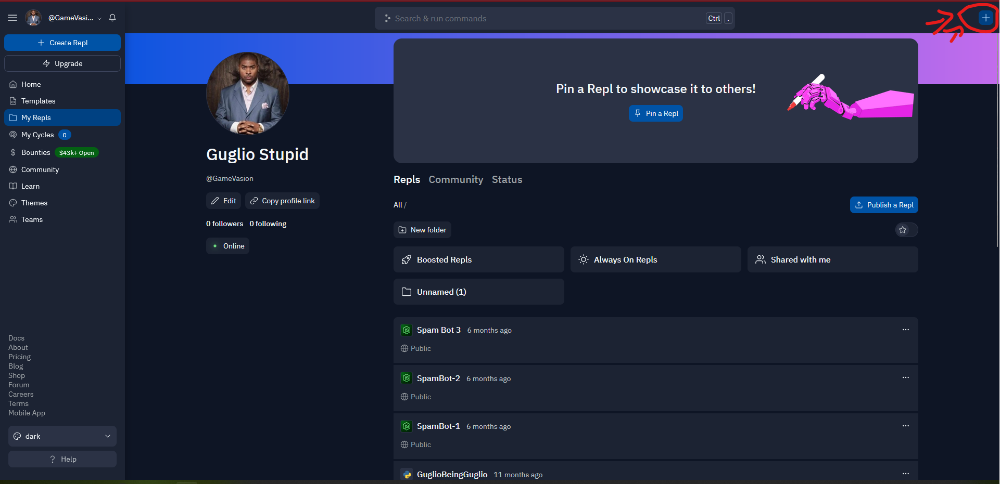
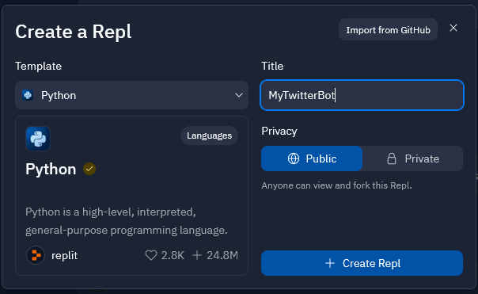
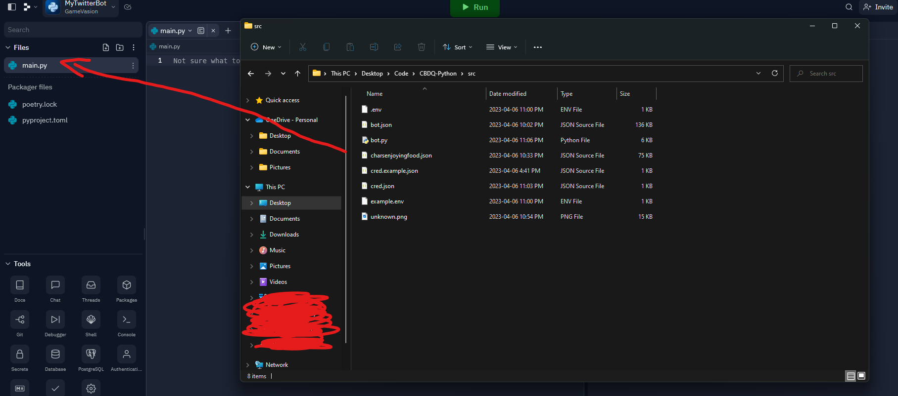
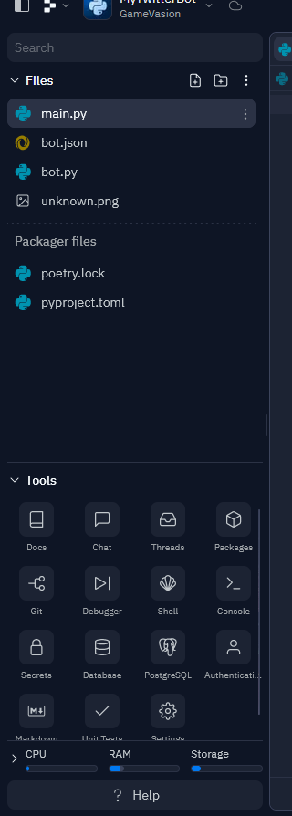

## How to host (Via Replit)

1. Go to [replit.com](replit.com) and create an account.

2. Make a new repo (The + at the top right of the screen)


3. Choose python and set a name


4. Drag and drop all source files (Specifically bot.py, bot.json, and unknown.png)
- Please note when hosting on replit, do not use cred.json, use .env
- I still recommend dragging over the template cred.json to avoid having to change some code
- Delete `main.py` and rename `bot.py` to `main.py`


5. Add your secrets

- consumer_key
- consumer_secret 
- access_token
- access_token_secret
- bearer_token
To get these keys, go to [Twitter Developer Portal](https://developer.twitter.com) and make a dev account (Free tier)

6. Making it stay online
- Make a file called `keep_alive.py`
- Copy and paste the following code into it:
```py
from flask import Flask
from threading import Thread

app = Flask('')

@app.route('/')
def home():
    return "I'm alive"

def run():
  app.run(host='0.0.0.0',port=8080)

def keep_alive():
    t = Thread(target=run)
    t.start()
```

- Copy and paste the following code into `main.py`:
```py
import keep_alive # at the top
# in the while loop
keep_alive.keep_alive()
```

Afterwords, you'll need to go to uptimerobot.com and create an account. Then, add a new monitor and set the type to HTTP(s) and set the URL to the URL of your repl. Then, set the alert contacts to your email and set the alert type to status change. Then, set the interval to 5 minutes. Then, click create monitor. You're done!

7. Run the bot